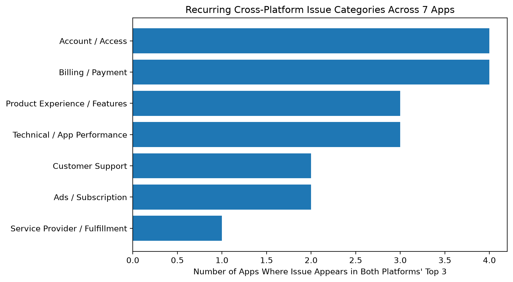
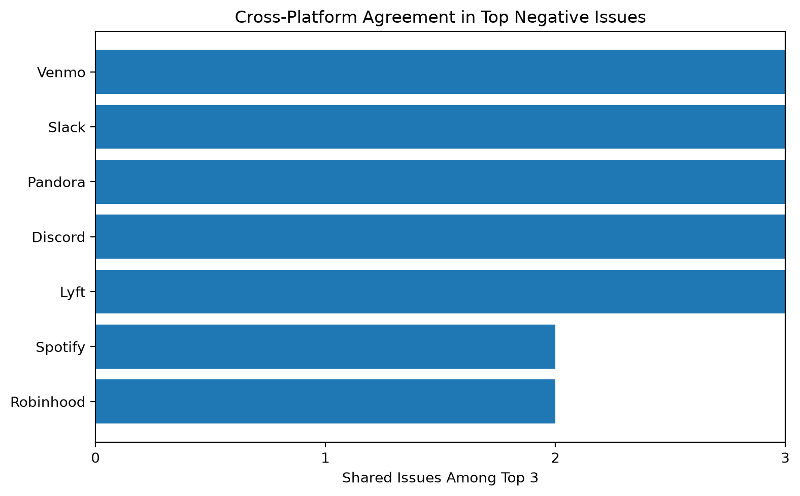

# Review Data Source Assessment and Cross-Platform Review Analysis

This project evaluates and analyzes user-review data sources for downstream sentiment, product-feedback, and business analysis.

The project is organized into two phases:

- **Phase I – Data Source Assessment:** evaluates Amazon, Google Play Store, and Apple App Store from business, technical, and practical perspectives.
- **Phase II – Large-Scale Collection and Analysis:** builds matched Google Play Store and Apple App Store review datasets and conducts data-quality, app-level, category-level, and issue-level cross-platform analysis.

Phase I identified Google Play Store as the strongest initial source for a recurring review-data workflow.

Phase II expands the project by using Google Play Store and Apple App Store in parallel to understand differences in ratings, review quality, metadata availability, review timing, and product-issue patterns.

> [!NOTE]
> **Phase I Recommendation: Google Play Store**
>
> Phase I recommended Google Play Store as the strongest initial source based on review richness, metadata availability, repeatability, extraction feasibility, and downstream analytical potential.
>
> Phase II extends the project by analyzing **Google Play Store and Apple App Store in parallel** using matched samples from the same applications.

---

## Outline

- [Overview](#overview)
- [Research Question](#research-question)
- [Evaluation Framework](#evaluation-framework)
- [Data Sources](#data-sources)
- [Practical Testing](#practical-testing)
- [Key Results](#key-results)
- [Phase II: Large-Scale Collection and Analysis](#phase-ii-large-scale-collection-and-analysis)
- [Phase II Dataset](#phase-ii-dataset)
- [Analysis Structure](#analysis-structure)
- [Current Findings](#current-findings)
- [Repository Structure](#repository-structure)
- [Installation](#installation)
- [Running the Project](#running-the-project)
- [Phase I Recommendation](#phase-i-recommendation)
- [Limitations](#limitations)
- [Next Steps](#next-steps)
- [Project Status](#project-status)

---

## Overview

The purpose of this project is to evaluate potential sources of user-generated review data and develop a structured workflow for cross-platform product-feedback analysis.

Three platforms were initially evaluated:

- **Amazon**
- **Google Play Store**
- **Apple App Store**

Phase I focuses on determining whether each source offers:

- Relevant and sufficiently rich user feedback
- Useful metadata for downstream analysis
- Publicly accessible review information
- A reasonably stable and repeatable collection process
- Suitable structure for future automated ingestion

Phase II moves beyond source selection into large-scale collection and analytical comparison of Google Play Store and Apple App Store reviews.

The full Phase I business and technical assessment is available in [`assessment.md`](./assessment.md).

The consolidated Phase II analytical findings are available in [`phase_ii_findings.md`](./phase_ii_findings.md).

---

## Research Question

### Phase I

**Which of Amazon, Google Play Store, and Apple App Store is the most suitable source for building a recurring review-data ingestion workflow for downstream sentiment analysis?**

### Phase II

**How do review ratings, review quality, metadata, time coverage, and product-issue patterns differ between Google Play Store and Apple App Store for the same applications?**

The issue-level extension also asks:

**Which negative-review issues recur across platforms and applications, and which appear more category-, product-type-, or app-specific?**

---

## Evaluation Framework

The three Phase I platforms were evaluated from two main perspectives.

### Business Perspective

| Criterion | Description |
|---|---|
| Review Relevance | How well reviews reflect actual user experiences |
| Review Richness | Level of detail and informational value in review content |
| Product Coverage | Range of products, services, or applications represented |
| Metadata Richness | Availability of ratings, dates, versions, and related metadata |
| Analytical Potential | Types of downstream analysis supported |
| Limitations | Potential biases or weaknesses in the data |

### Technical / Practical Perspective

| Criterion | Description |
|---|---|
| Public Accessibility | Whether review-related data can be accessed without login |
| Data Structure | Consistency and usability of returned data |
| Repeatability | Whether collection appears reproducible across repeated requests |
| Restrictions | API, authorization, or public-web collection limitations |
| Recurring Workflow Suitability | Suitability for ongoing automated ingestion |

---

## Data Sources

The Phase I assessment focuses on publicly visible customer review data from three platforms.

| Platform | Data Type | Representative Page Used for Testing |
|---|---|---|
| Amazon | Product reviews | [Amazon Echo Dot (5th Gen)](https://www.amazon.com/Amazon-vibrant-helpful-routines-Charcoal/dp/B09B8V1LZ3) |
| Google Play Store | Mobile app reviews | [Spotify - Google Play](https://play.google.com/store/apps/details?id=com.spotify.music) |
| Apple App Store | Mobile app reviews | [Spotify - Apple App Store](https://apps.apple.com/us/app/spotify-music-and-podcasts/id324684580) |

The Google Play Store and Apple App Store tests use Spotify as a representative application to make the comparison between the two app platforms more consistent.

Amazon uses a representative consumer product page because Amazon primarily provides product-level rather than application-level customer reviews.

These pages were used only for lightweight feasibility testing. The project does not assume that results from a single page represent all pages available on each platform.

### Official Documentation Referenced

The technical assessment also considers official platform documentation related to programmatic review access:

- [Amazon Creators API Documentation](https://affiliate-program.amazon.com/creatorsapi/docs/en-us/introduction)
- [Amazon Creators API Resources](https://affiliate-program.amazon.com/creatorsapi/docs/en-us/api-reference/resources)
- [Google Play Developer API](https://developers.google.com/android-publisher)
- [Google Play Reviews Resource](https://developers.google.com/android-publisher/api-ref/rest/v3/reviews)
- [Google Play Reviews List Method](https://developers.google.com/android-publisher/api-ref/rest/v3/reviews/list)
- [Apple App Store Connect API](https://developer.apple.com/documentation/appstoreconnectapi)
- [Apple Customer Reviews Documentation](https://developer.apple.com/documentation/appstoreconnectapi/customer-reviews)
- [Apple Customer Reviews API Endpoint](https://developer.apple.com/documentation/appstoreconnectapi/get-v1-apps-_id_-customerreviews)

---

## Practical Testing

In addition to secondary research, several lightweight Python tests were conducted during Phase I.

The purpose was **not to build a production scraper**, but to compare the initial technical feasibility of the three platforms.

### 1. Basic Programmatic Accessibility Test

Python `requests` was used to retrieve one representative public page from each platform.

| Platform | HTTP Status | Initial Result |
|---|---:|---|
| Amazon | 200 | Successfully retrieved |
| Google Play Store | 200 | Successfully retrieved |
| Apple App Store | 200 | Successfully retrieved |

All three platforms were initially accessible through basic HTTP requests.

### 2. Review Field Availability Test

Returned page content was checked for review-related terms such as:

- `review`
- `rating`
- `date`
- `version`
- `author`
- `helpful`

Google Play Store exposed the broadest range of review-related information in this lightweight test.

### 3. Repeatability Test

Repeated HTTP requests produced different results across platforms.

Google Play Store and Apple App Store returned relatively consistent responses.

Amazon showed substantially different responses between runs, including one response that returned a much smaller page despite still returning HTTP status code `200`.

This suggests that successful HTTP status alone may not guarantee consistent retrieval of the expected Amazon product page.

### 4. Small Review Extraction Test

A lightweight structured extraction test was conducted using:

- `requests`
- `BeautifulSoup`
- CSS selectors identified through manual DOM inspection

Results:

| Platform | Candidate Review Blocks Found | Sample Review Text Extracted |
|---|---:|---|
| Google Play Store | 3 | Yes |
| Apple App Store | 8 | Yes |
| Amazon | 0 | No |

Both Google Play Store and Apple App Store successfully exposed identifiable individual review blocks through the lightweight HTML extraction approach.

Amazon produced a different result. Review-specific elements were visible during manual inspection of the browser-rendered DOM, but the same review containers were not identified in the HTML returned through the basic Python request.

This suggests that a simple `requests` and `BeautifulSoup` workflow may not consistently reproduce the Amazon review structure visible in a fully rendered browser.

---

## Key Results

| Dimension | Amazon | Google Play Store | Apple App Store |
|---|---|---|---|
| Business Value | Very High | Very High | High |
| Product Coverage | Very High | Medium–High | Medium–High |
| Metadata Richness | High | Very High | High |
| Initial HTTP Accessibility | Successful | Successful | Successful |
| Observed Repeatability | Low–Medium | High in limited testing | High in limited testing |
| Lightweight Review Extraction | Not successful | Successful | Successful |
| Initial Workflow Suitability | Low–Medium | Medium–High | Medium–High |

The detailed reasoning behind these assessments is documented in [`assessment.md`](./assessment.md).

---

## Phase II: Large-Scale Collection and Analysis

Following the Phase I source assessment, Phase II expands the project into large-scale review collection and exploratory analysis using Google Play Store and Apple App Store in parallel.

The Phase II design emphasizes **paired comparisons of the same applications across platforms** rather than relying only on platform-wide averages.

### Sampling Design

The final sampling design includes:

- 28 shared applications
- 6 application categories
- Google Play Store and Apple App Store
- Matched review counts at the application level

The six study categories are:

- Education
- Finance
- Music & Audio
- Productivity & Cloud
- Social & Community
- Travel & Mobility

---

## Phase II Dataset

Large raw datasets were first collected separately from each platform.

The datasets were then processed to:

- Remove duplicate review IDs from the analysis samples
- Match review counts for the same application across platforms
- Preserve the original raw datasets separately
- Maintain application and category identifiers for paired analysis

Final matched analysis datasets:

| Platform | Apps | Reviews |
|---|---:|---:|
| Apple App Store | 28 | 13,599 |
| Google Play Store | 28 | 13,599 |

Matching review counts improves same-app comparability, but does **not** guarantee that the two platforms represent the same historical time window.

For some applications, the same number of reviews represents substantially different periods across the two platforms.

Timestamp coverage is therefore treated as a central robustness consideration throughout the analysis.

---

## Analysis Structure

Phase II analysis is organized into four notebooks.

### `01_data_quality.ipynb`

Examines:

- Missing values
- Duplicate review IDs
- Repeated review text
- Rating distributions
- Review length
- Low-information comments
- Timestamp coverage
- Metadata availability

### `02_paired_app_analysis.ipynb`

Focuses on paired comparisons of the same applications across platforms, including:

- Cross-platform rating gaps
- Timestamp-coverage diagnostics
- Rating distributions for selected paired apps
- Review length and low-signal differences
- Negative-review detail
- Product/business implications

### `03_category_analysis.ipynb`

Examines whether app-level differences extend to broader categories, including:

- Category-level rating differences
- Consistency of rating direction within categories
- Timestamp sensitivity analysis
- Category-level review quality
- Short-review and repeated-text patterns

### `04_text_issue_analysis.ipynb`

Extends the analysis from ratings and review quality into product-issue analysis of negative reviews.

The notebook includes:

- Negative-review extraction
- Transparent multi-label issue taxonomy development
- Version 1, Version 2, and Version 3 taxonomy refinement
- Manual inspection of reviews classified as `Other`
- Qualitative representative-review validation
- Cross-platform issue-rate comparisons
- Timestamp-overlap diagnostics
- Initial detailed analysis of Venmo, Pandora, and Lyft
- Expanded analysis of Robinhood, Spotify, Slack, and Discord
- Unified Version 3 classification across seven applications
- Cross-app recurring-issue analysis
- Comparison of recurring, category-related, product-type, and app-specific patterns
- Saved app-level and summary visualizations

The seven applications included in the expanded issue-level analysis are:

- Venmo
- Pandora
- Lyft
- Robinhood
- Spotify
- Slack
- Discord

The issue taxonomy is keyword-assisted, multi-label, manually refined, and exploratory rather than a formally validated supervised classification model.

---

## Current Findings

Current Phase II analysis suggests several distinct types of cross-platform patterns.

### Rating and Review-Quality Findings

- Cross-platform rating differences are highly application-specific and should not be interpreted using platform-wide averages alone.
- Finance shows one of the more robust category-level Google-higher rating patterns after considering timestamp comparability.
- Social & Community also shows consistently higher Google Play ratings, although timestamp mismatch limits stronger interpretation.
- Apple App Store reviews are longer across all six study categories in the current matched sample.
- Google Play contains a higher proportion of very short and repeated review text across all six categories.
- Lower-rated reviews generally contain more detailed written feedback on both platforms.
- Equal review counts can represent substantially different historical time windows across platforms.
- Platform-specific metadata availability affects which downstream analyses are appropriate.

### Seven-App Issue Analysis

The expanded issue-level analysis shows substantial cross-platform agreement in the dominant complaint categories.

Five of seven applications share **all three** of their top negative-review issue categories across Apple App Store and Google Play:

- Discord
- Lyft
- Pandora
- Slack
- Venmo

Robinhood and Spotify share two of their three dominant issue categories.

This suggests that platform differences often affect the **relative concentration of complaints** rather than completely changing the underlying issue structure.

### Recurring Cross-App Issues

Several issue categories repeatedly appear among the dominant negative-review issues on both platforms.

| Issue | Number of Apps | Applications |
|---|---:|---|
| Account / Access | 4 | Discord, Robinhood, Slack, Venmo |
| Billing / Payment | 4 | Lyft, Robinhood, Spotify, Venmo |
| Product Experience / Features | 3 | Discord, Pandora, Slack |
| Technical / App Performance | 3 | Discord, Pandora, Slack |
| Ads / Subscription | 2 | Pandora, Spotify |
| Customer Support | 2 | Lyft, Venmo |
| Service Provider / Fulfillment | 1 | Lyft |



### Cross-Platform Top-Issue Agreement

The dominant complaint structure is highly consistent for most of the seven analyzed applications.



### Potential Category- and Product-Type Patterns

#### Finance

Venmo and Robinhood both prominently feature:

- Billing / Payment
- Account / Access

among their dominant cross-platform negative-review issues.

This provides the clearest potential category-level recurring pattern in the current seven-app issue sample.

#### Music & Audio

Pandora and Spotify both prominently feature:

- Ads / Subscription

However, their other dominant complaint categories differ more substantially.

Music & Audio therefore shows partial recurrence rather than a completely consistent issue structure.

#### Communication and Collaboration Products

Discord and Slack both prominently feature:

- Product Experience / Features
- Technical / App Performance
- Account / Access

They belong to different study categories, so this pattern is interpreted as recurrence across related product types rather than a formal category-level effect.

#### Lyft

Lyft remains the clearest service-model-specific case.

`Service Provider / Fulfillment` dominates negative feedback on both Apple App Store and Google Play, reflecting the operational nature of ride-service delivery.

### Selected App-Level Findings

#### Lyft

Lyft shows a highly similar core complaint structure across both platforms.

`Service Provider / Fulfillment` is the dominant issue:

| Platform | Share of Negative Reviews |
|---|---:|
| Apple App Store | 65.69% |
| Google Play | 67.92% |

Billing and payment complaints are also common on both platforms.

This suggests that Lyft's dominant negative-feedback themes are broadly cross-platform rather than specific to one store.

#### Pandora

Pandora shows one of the clearest differences in complaint concentration.

Google Play negative reviews contain more Technical / App Performance complaints:

| Platform | Technical / App Performance |
|---|---:|
| Apple App Store | 20.31% |
| Google Play | 33.68% |

Apple negative reviews contain more:

| Issue | Apple | Google Play |
|---|---:|---:|
| Ads / Subscription | 50.00% | 24.87% |
| Product Experience / Features | 42.19% | 18.13% |
| Billing / Payment | 18.75% | 10.36% |

This suggests that the same application can share dominant complaint categories across platforms while still showing meaningful differences in issue concentration.

#### Venmo

Venmo shows similar core complaint categories across platforms.

Billing / Payment is the most common issue on both:

| Platform | Billing / Payment |
|---|---:|
| Apple App Store | 44.04% |
| Google Play | 47.79% |

However, Apple negative reviews contain relatively more Account / Access, Customer Support, and Technical / App Performance complaints.

This suggests that Venmo's rating gap may reflect different concentrations of similar underlying problems rather than completely different issue types.

### Timestamp Robustness in the Expanded Sample

Timestamp overlap was evaluated before interpreting the four newly added applications.

Robinhood and Slack provide the strongest comparison cases.

- Robinhood: 73.06% of the Apple review window overlaps with Google, while 99.83% of the Google window overlaps with Apple.
- Slack: 67.91% of the Apple review window overlaps with Google, while the Google window is fully contained within the Apple window.

Discord has moderate comparability.

Spotify has the weakest overlap and is therefore treated as a more exploratory comparison.

These checks reinforce the importance of evaluating issue differences together with review timing rather than attributing observed differences directly to platform effects.

### Business Relevance

The analysis suggests that platform choice may affect:

- Observed sentiment
- Review richness
- Issue concentration
- Metadata availability
- Historical time coverage

The strongest current analytical workflow is therefore:

```text
Same Application
      ↓
Apple vs Google
      ↓
Rating + Review Quality + Time Coverage
      ↓
Negative Review Issues
      ↓
Recurring vs App-Specific Patterns
      ↓
Product Interpretation
```

If the same dominant issues appear across both platforms, the issue may represent a broader product concern.

If complaint concentration or composition differs substantially, platform-specific feedback may warrant separate investigation.

These findings are descriptive and exploratory and should not be interpreted as causal platform effects.

---

## Repository Structure

```text
review-data-source-analysis/
│
├── README.md
├── assessment.md
├── data_collection_plan.md
├── phase_ii_findings.md
│
├── scripts/
│   ├── practical_test.py
│   ├── review_extraction_test.py
│   ├── collect_google_play.py
│   ├── collect_google_play_multiapp.py
│   ├── collect_google_play_full.py
│   ├── collect_google_play_balanced.py
│   ├── collect_apple_store.py
│   ├── collect_apple_store_multiapp.py
│   ├── collect_apple_store_full.py
│   └── build_balanced_analysis_datasets.py
│
├── notebooks/
│   ├── 01_data_quality.ipynb
│   ├── 02_paired_app_analysis.ipynb
│   ├── 03_category_analysis.ipynb
│   └── 04_text_issue_analysis.ipynb
│
├── figures/
│   ├── venmo_negative_issue_profile.png
│   ├── pandora_negative_issue_profile.png
│   ├── lyft_negative_issue_profile.png
│   ├── cross_app_issue_recurrence.png
│   └── cross_platform_top_issue_agreement.png
│
└── data/
    ├── raw/
    │   ├── google_play_reviews.csv
    │   ├── google_play_balanced_reviews.csv
    │   ├── apple_store_reviews.csv
    │   └── collection summary / validation outputs
    │
    ├── processed/
    │   ├── google_play_analysis.csv
    │   ├── apple_store_analysis.csv
    │   └── matched_sample_counts.csv
    │
    ├── practical_test_results.csv
    ├── field_availability_results.csv
    └── review_extraction_results.csv
```

### Key Files

#### `assessment.md`

Contains the full Phase I comparison of Amazon, Google Play Store, and Apple App Store, including business assessment, technical assessment, practical testing, and the initial source recommendation.

#### `data_collection_plan.md`

Documents the Phase II sampling strategy, selected applications, expected fields, collection methodology, and data-quality considerations.

#### `phase_ii_findings.md`

Consolidates the main Phase II analytical findings across:

- Data quality
- Paired same-app comparisons
- Category-level patterns
- Negative-review issue analysis
- Expanded seven-app issue analysis
- Timestamp robustness
- Business implications
- Limitations
- Recommended next steps

#### `scripts/`

Contains the Phase I feasibility tests, Phase II review-collection scripts, and dataset-preparation workflows.

Key Phase II scripts include:

- `collect_google_play_balanced.py` – collects reviews across the shared Google Play app sample
- `collect_apple_store_full.py` – collects the large-scale Apple App Store sample
- `build_balanced_analysis_datasets.py` – creates the matched datasets used for cross-platform analysis

Earlier single-app and multi-app scripts are retained to document the development and validation of the collection workflow.

#### `notebooks/01_data_quality.ipynb`

Examines missing values, duplicates, repeated text, rating distributions, review length, timestamp coverage, and metadata availability.

#### `notebooks/02_paired_app_analysis.ipynb`

Performs paired same-app comparisons across Google Play Store and Apple App Store.

#### `notebooks/03_category_analysis.ipynb`

Examines category-level consistency, timestamp sensitivity, and review-quality patterns.

#### `notebooks/04_text_issue_analysis.ipynb`

Performs exploratory multi-label negative-review issue analysis.

It includes:

- Taxonomy development and refinement
- Version 1, Version 2, and Version 3 classifications
- Manual `Other` review inspection
- Representative-review validation
- Seven-app cross-platform analysis
- Timestamp-overlap diagnostics
- Cross-app issue recurrence
- Product-level interpretation

#### `figures/`

Contains saved Phase II issue-analysis visualizations.

Current figures include:

- `venmo_negative_issue_profile.png`
- `pandora_negative_issue_profile.png`
- `lyft_negative_issue_profile.png`
- `cross_app_issue_recurrence.png`
- `cross_platform_top_issue_agreement.png`

#### `data/raw/`

Contains the original large-scale collection outputs.

#### `data/processed/`

Contains the cleaned and matched datasets used for the main Phase II analysis.

---

## Installation

### Requirements

- Python 3
- Pandas
- Requests
- BeautifulSoup4
- Matplotlib
- Jupyter / IPython kernel
- google-play-scraper

Install the required packages:

```bash
python -m pip install pandas requests beautifulsoup4 matplotlib jupyter ipykernel google-play-scraper
```

---

## Running the Project

The repository contains both Phase I feasibility tests and Phase II large-scale collection and analysis workflows.

### Phase I: Practical Tests

Run the basic accessibility and field-availability test:

```bash
python scripts/practical_test.py
```

Run the lightweight review extraction test:

```bash
python scripts/review_extraction_test.py
```

### Phase II: Review Collection

#### Google Play Store

Run the balanced multi-app collection:

```bash
python scripts/collect_google_play_balanced.py
```

Primary output:

```text
data/raw/google_play_balanced_reviews.csv
```

#### Apple App Store

Run the large-scale Apple App Store collection:

```bash
python scripts/collect_apple_store_full.py
```

Primary output:

```text
data/raw/apple_store_reviews.csv
```

### Build Matched Analysis Datasets

After collecting the raw datasets, run:

```bash
python scripts/build_balanced_analysis_datasets.py
```

This creates:

```text
data/processed/apple_store_analysis.csv
data/processed/google_play_analysis.csv
data/processed/matched_sample_counts.csv
```

### Phase II Analysis

The main exploratory analysis is contained in:

```text
notebooks/01_data_quality.ipynb
notebooks/02_paired_app_analysis.ipynb
notebooks/03_category_analysis.ipynb
notebooks/04_text_issue_analysis.ipynb
```

The analytical progression is:

```text
Data Quality
      ↓
Paired Same-App Analysis
      ↓
Category-Level Analysis
      ↓
Negative Review Issue Analysis
      ↓
Taxonomy Refinement
      ↓
Seven-App Cross-Platform Comparison
      ↓
Recurring vs App-Specific Patterns
      ↓
Product / Business Interpretation
```

---

## Phase I Recommendation

### Google Play Store

Based on the Phase I business assessment, technical research, and practical testing, **Google Play Store was recommended as the initial data source for a prototype recurring ingestion workflow**.

Both Google Play Store and Apple App Store demonstrated successful lightweight review extraction during the initial feasibility testing.

Google Play Store was preferred because it combined practical extraction feasibility with richer potential analytical metadata and strong downstream analytical potential.

This recommendation served as the starting point for the project rather than a final production-scale source-selection decision.

Phase II therefore expanded the project to include **both Google Play Store and Apple App Store in parallel**, allowing the project to evaluate not only collection feasibility but also differences in review content, ratings, metadata, review timing, and product issues at scale.

Amazon remains an attractive future source because of its broad product coverage and rich customer feedback. However, the current testing showed greater technical uncertainty for a simple recurring public-web workflow.

Apple App Store remains an analytically valuable complementary source, particularly because of the richer review text and highly complete application-version information observed in the current dataset.

The Phase II findings therefore do not support selecting one app-review platform as universally superior for analytical purposes.

---

## Limitations

The project has progressed from an initial feasibility assessment into large-scale exploratory and issue-level analysis, but several limitations remain.

### Collection Limitations

- Public review-access methods may change over time.
- Platform pagination and review availability are not always stable.
- The Apple App Store review feed showed variation in available review depth across collection attempts.
- Google Play and Apple App Store expose different metadata fields, limiting direct comparison of some attributes.
- Public collection methods may not provide the same capabilities as official owner/developer APIs.

### Sampling Limitations

- Review counts are matched by application, but matching record counts does not guarantee matching time periods.
- In many applications, the same number of Apple and Google reviews represents substantially different historical coverage.
- Some applications had fewer available Apple reviews and therefore contributed smaller matched samples.

### Review-Length Limitation

Observed review-length differences may reflect both user behavior and platform or collection characteristics.

The collected Google Play review text shows an apparent ceiling around approximately 500 characters, while Apple reviews can be substantially longer.

The finding that Apple reviews are longer should therefore be interpreted as a characteristic of the observed datasets rather than evidence that Apple users inherently write more detailed reviews.

### Analytical Limitations

- Observed cross-platform differences are descriptive and should not be interpreted as causal platform effects.
- Differences may reflect app-specific events, release timing, user populations, platform behavior, or collection characteristics.
- Repeated review text is not automatically treated as duplicate data because different users may independently submit identical short comments.
- Low-information thresholds such as reviews with 20 characters or fewer are exploratory analytical definitions rather than formal quality standards.

### Timestamp Limitation

Equal review counts do not guarantee equivalent historical coverage.

Timestamp-overlap analysis improves interpretation but does not completely eliminate differences in review timing.

Cross-platform issue-rate or rating differences may therefore partly reflect different product periods.

Applications with weaker overlap, such as Spotify in the expanded issue sample, are interpreted more cautiously.

### Issue-Taxonomy Limitations

The Version 3 negative-review issue taxonomy is:

- Keyword-assisted
- Multi-label
- Manually refined
- Application-aware
- Exploratory

Representative reviews and reviews initially classified as `Other` were manually inspected during taxonomy development.

The taxonomy improved coverage across the seven selected applications, but several limitations remain:

- Classification rules were developed using the same review sample being analyzed.
- App-specific keywords were added after inspection of recurring complaint language.
- Some applications retain substantial `Other` rates.
- Slack remains particularly weakly represented by the current taxonomy.
- A single review may receive multiple labels.
- The taxonomy has not been evaluated using an independently labeled validation dataset.
- Formal precision, recall, and F1 measurements have not been calculated.

Issue rates should therefore be interpreted as **directional analytical evidence rather than validated population prevalence estimates**.

---

## Next Steps

The next stage of the project should deepen and validate the issue-level analysis already completed rather than simply expanding the number of applications.

Recommended priorities are:

1. **Consolidate the seven-app issue findings**
   - Continue distinguishing cross-platform-consistent, recurring cross-app, category-related, product-type, and app-specific patterns.

2. **Validate the Version 3 taxonomy**
   - Build a manually labeled review sample.
   - Compare human labels with the keyword-assisted classification.
   - Evaluate precision, recall, F1, and multi-label agreement.

3. **Improve timestamp alignment**
   - Repeat selected comparisons using the same calendar periods where possible.
   - Prioritize stronger comparison cases such as Robinhood and Slack.

4. **Expand issue analysis selectively**
   - Add applications only when they help test a specific recurring or category-level pattern.

5. **Investigate version-level patterns**
   - Examine rating and issue changes around application releases where version metadata is sufficiently complete.

6. **Analyze Google Play developer responses**
   - Examine response rates, timing, and issue types where response metadata is available.

7. **Develop product-focused reporting**
   - Convert the strongest analytical findings into concise summaries and publication-ready visualizations.

A potential future workflow is:

```text
Review Sources
      ↓
Large-Scale Collection
      ↓
Quality Validation
      ↓
Matched Cross-Platform Analysis
      ↓
Negative Review Issue Analysis
      ↓
Taxonomy Validation
      ↓
Time / Version Robustness
      ↓
Product & Business Insights
```

The immediate analytical priority is therefore **robustness and validation**, not broad uncontrolled expansion.

---

## Project Status

**Phase I:** Completed – Data source assessment and feasibility testing

**Phase I Recommendation:** Google Play Store as the initial prototype source

**Phase II Collection:** Completed – Large-scale Google Play and Apple App Store review collection

**Matched Analysis Dataset:** Completed – 28 shared applications across 6 categories, with 13,599 reviews per platform

**Data Quality Analysis:** Completed

**Paired Same-App Analysis:** Completed

**Category-Level Analysis:** Completed

**Initial Issue Analysis:** Completed for Venmo, Pandora, and Lyft

**Expanded Issue Analysis:** Completed for Robinhood, Spotify, Slack, and Discord

**Unified Issue Taxonomy:** Version 3 applied across all seven selected applications

**Timestamp Robustness:** Overlap diagnostics completed for the expanded issue-analysis sample

**Cross-App Recurrence Analysis:** Completed – recurring and app-specific issue patterns identified across seven applications

**Current Figures:**

- Venmo negative-review issue profile
- Pandora negative-review issue profile
- Lyft negative-review issue profile
- Cross-app issue recurrence
- Cross-platform top-issue agreement

**Current Analytical Focus:** Validating the Version 3 taxonomy, improving timestamp alignment for selected comparisons, and translating recurring and app-specific findings into product-focused reporting

**Secondary Future Analysis:** Version-level patterns and Google Play developer-response analysis
